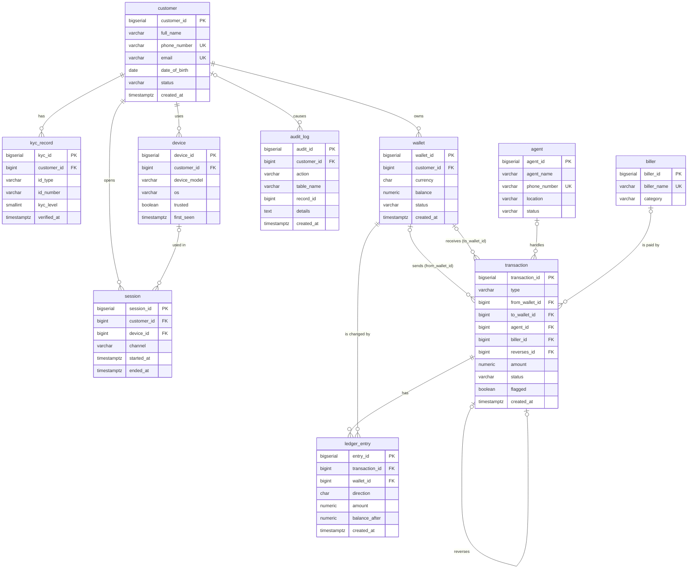

# MoniWallet ER diagram

This diagram is made from `schema.sql`. GitHub shows it as a picture. The same design is also in `er-diagram.dbml` for dbdiagram.io.

```mermaid
erDiagram
    customer ||--o{ kyc_record : "has"
    customer ||--o{ wallet : "owns"
    customer ||--o{ device : "uses"
    customer ||--o{ session : "opens"
    customer |o--o{ audit_log : "causes"
    device |o--o{ session : "used in"
    wallet |o--o{ transaction : "sends (from_wallet_id)"
    wallet |o--o{ transaction : "receives (to_wallet_id)"
    agent |o--o{ transaction : "handles"
    biller |o--o{ transaction : "is paid by"
    transaction |o--o| transaction : "reverses"
    transaction ||--o{ ledger_entry : "has"
    wallet ||--o{ ledger_entry : "is changed by"

    customer {
        bigserial customer_id PK
        varchar full_name
        varchar phone_number UK
        varchar email UK
        date date_of_birth
        varchar status
        timestamptz created_at
    }

    kyc_record {
        bigserial kyc_id PK
        bigint customer_id FK
        varchar id_type
        varchar id_number
        smallint kyc_level
        timestamptz verified_at
    }

    wallet {
        bigserial wallet_id PK
        bigint customer_id FK
        char currency
        numeric balance
        varchar status
        timestamptz created_at
    }

    agent {
        bigserial agent_id PK
        varchar agent_name
        varchar phone_number UK
        varchar location
        varchar status
    }

    biller {
        bigserial biller_id PK
        varchar biller_name UK
        varchar category
    }

    transaction {
        bigserial transaction_id PK
        varchar type
        bigint from_wallet_id FK
        bigint to_wallet_id FK
        bigint agent_id FK
        bigint biller_id FK
        bigint reverses_id FK
        numeric amount
        varchar status
        boolean flagged
        timestamptz created_at
    }

    ledger_entry {
        bigserial entry_id PK
        bigint transaction_id FK
        bigint wallet_id FK
        char direction
        numeric amount
        numeric balance_after
        timestamptz created_at
    }

    device {
        bigserial device_id PK
        bigint customer_id FK
        varchar device_model
        varchar os
        boolean trusted
        timestamptz first_seen
    }

    session {
        bigserial session_id PK
        bigint customer_id FK
        bigint device_id FK
        varchar channel
        timestamptz started_at
        timestamptz ended_at
    }

    audit_log {
        bigserial audit_id PK
        bigint customer_id FK
        varchar action
        varchar table_name
        bigint record_id
        text details
        timestamptz created_at
    }
```
